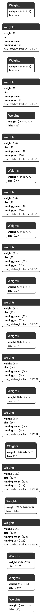
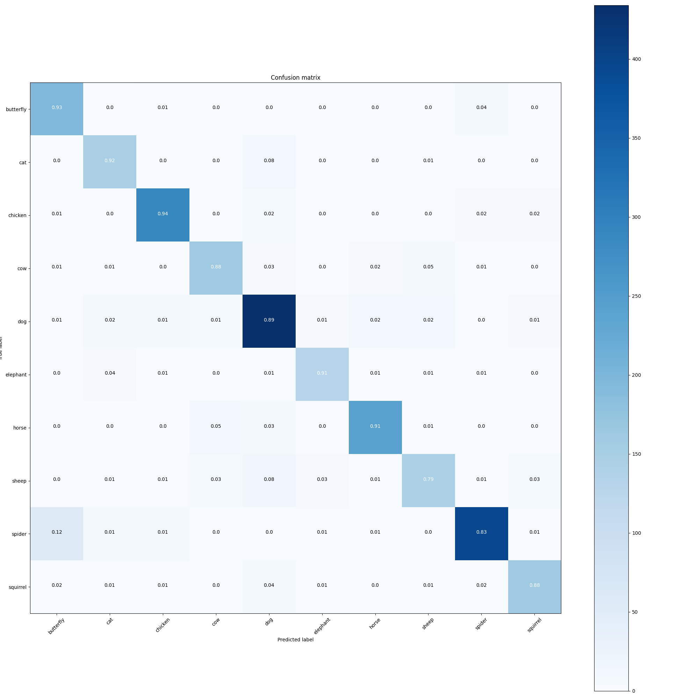
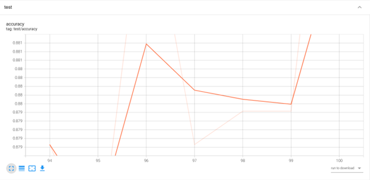
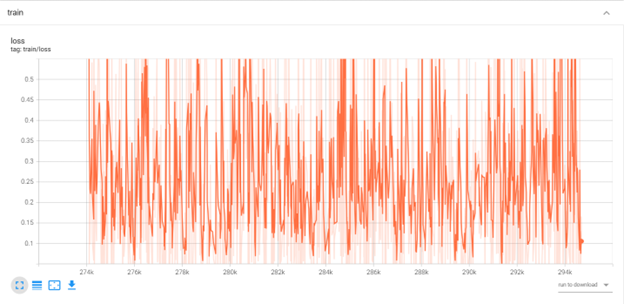
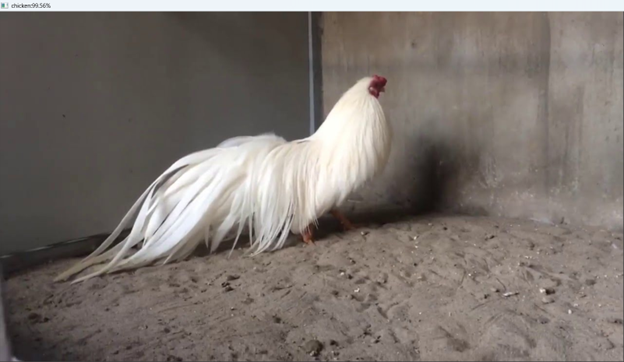

# animal-recognition-pytorch
# Animal Recognition using CNN (PyTorch)

## Introduction

This project implements an **Animal Image Classification system** using a **Convolutional Neural Network (CNN)** built with PyTorch.
The model is trained to recognize different animal categories from images.

The project demonstrates a full **deep learning workflow**, including:

* Dataset preparation
* Data augmentation
* CNN model training
* Model evaluation
* Prediction visualization

---

## Technologies Used

* Python
* PyTorch
* Torchvision
* Scikit-learn
* NumPy
* Matplotlib
* TensorBoard
* tqdm

---

## Project Structure

```
animal-recognition-pytorch
│
├── data
│   └── README.md
│
├── outputs
│   ├── accuracy_curve.png
│   ├── loss_curve.png
│   ├── confusion_matrix.png
│   ├── cnn_architecture.png
│   ├── prediction_cat.png
│   ├── prediction_butterfly.png
│   └── prediction_chicken.png
│
├── src
│   ├── models
│   │   └── simple_cnn.py
│   │
│   ├── setupdataset.py
│   ├── train_cnn.py
│   └── test_cnn.py
│
├── train_models
│   └── README.md
│
└── README.md
```

---

## Dataset

The dataset contains images of animals used to train the CNN model.

Dataset structure:

```
animals_v2
└── animals
    ├── train
    │   ├── cat
    │   ├── dog
    │   ├── elephant
    │   ├── horse
    │   └── ...
    │
    └── test
        ├── cat
        ├── dog
        ├── elephant
        ├── horse
        └── ...
```

Images are loaded using a custom dataset class.

---

## Model Architecture

The model is a **Convolutional Neural Network (CNN)** consisting of:

* Convolution Layers
* Batch Normalization
* ReLU Activation
* MaxPooling
* Fully Connected Layers
* Softmax Output

Architecture visualization:



---

## Training

To train the model:

```
python src/train_cnn.py
```

Training configuration:

* Epochs: 100
* Batch Size: 8
* Image Size: 224 × 224
* Optimizer: SGD
* Loss Function: CrossEntropyLoss

Data augmentation techniques:

* RandomAffine
* ColorJitter
* Resize
* ToTensor

---

## Evaluation

The model is evaluated using:

* Accuracy
* Confusion Matrix

Example confusion matrix:



---

## Training Results

Accuracy Curve



Loss Curve



---

## Prediction Examples

Cat Prediction


Butterfly Prediction


Chicken Prediction



---

## Model Checkpoints

Model checkpoints are saved in:

```
train_models/
```

Files include:

* `best_model.pt` – best model based on accuracy
* `last_model.pt` – latest training checkpoint

---

## Requirements

Python >= 3.9

Install dependencies:

```
pip install torch torchvision scikit-learn numpy matplotlib tqdm tensorboard
```

Or install using:

```
pip install -r requirements.txt
```
